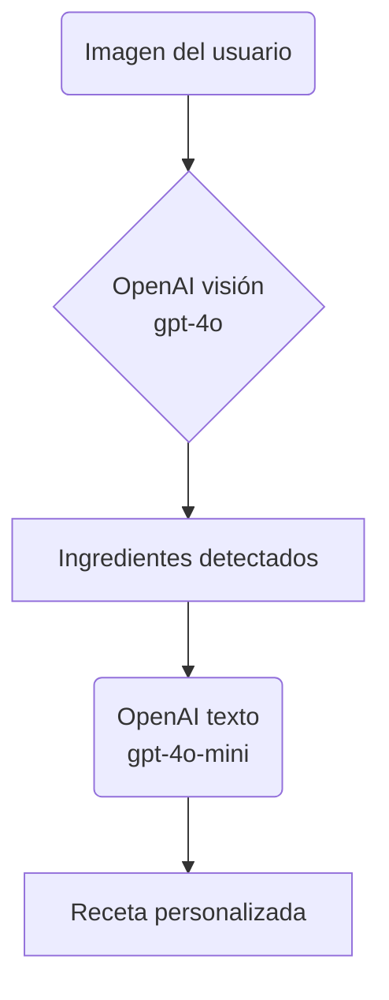

# 🌱 Good Bits

---

## 🧠 Arquitectura y STACK Sugerido

### ⚙️ Backend for Frontend

* **Lenguaje / Framework**: [Ruby](https://www.ruby-lang.org/en/) + [Ruby on Rails](https://rubyonrails.org/) (+ RestAPI).  
* **Base de datos**: [PostgreSQL](https://www.postgresql.org/).  
* **Autenticación**: Devise + JWT, OAuth y correos transaccionales con [Postmark](https://postmarkapp.com/) o [SendGrid](https://sendgrid.com/).  
* **Wrapper OpenAI**: [`openai` gem](https://github.com/alexrudall/ruby-openai) con el modelo [`gpt‑4o‑mini`](https://platform.openai.com/docs/models/compare?model=gpt-4o).  
* **Arquitectura**: *Backend‑for‑Frontend* (BFF) con API REST; preparada para microservicios y apps nativas futuras.

### 🤖 Inteligencia Artificial para Recetas

* ChatGPT embebido (`gpt‑4o‑mini` o `gpt‑3.5‑turbo`).  
* Prompts combinan ingredientes del usuario, preferencias dietéticas y recetas de la marca OQ.  
* Endpoint principal: `POST /api/v1/recipes/suggest`.

### 📍 Mapas y Geolocalización

| Funcionalidad | Herramientas |
|---------------|--------------|
| Estaciones RVM | [Google Maps SDK](https://developers.google.com/maps/documentation) / [Mapbox](https://www.mapbox.com/) |
| Alertas de proximidad | [OneSignal](https://onesignal.com/) + geofencing nativo |

### 🧠 Flujo de Procesamiento

---

### 🗂️ Almacenamiento

* **Archivos**: [AWS S3](https://aws.amazon.com/s3/) o [DigitalOcean Spaces](https://www.digitalocean.com/products/spaces).
* **Infraestructura**: [DigitalOcean Droplet](https://www.digitalocean.com/products/droplets/).

### 📢 Notificaciones

* **Push**: OneSignal (plan gratuito hasta 30 k).  
* **Email**: Mailjet / SendGrid

---

## 🏅 Gamificación

* Puntos por recetas cocinadas, ingredientes rescatados y plástico reciclado.  
* Sistema de badges (`Badge`, `UserBadge`) con niveles y progresos.

---
